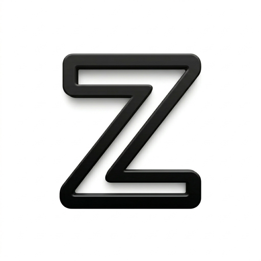

  

# @kongyo2/z-etter-mcp

[Zetter（ゼッター / z-etter.com）](https://z-etter.com) に投稿するための [MCP（Model Context Protocol）](https://modelcontextprotocol.io) サーバーです。Claude Desktop・Claude Code をはじめとする MCP ホストから、テキスト投稿を作成できます。

> Zetter の公開 API（`POST /api/v1/posts`）をラップしています。API 経由の投稿には Zetter 上で **「AI」バッジ** が付きます。

## ライセンス

[MIT](./LICENSE)
